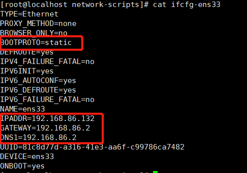

# 第0小节 自定义笔记

## 1.Ubuntu防火墙

* `ufw status`查看防火墙状态

  遇见配置好了端口但是无法使用的情况，先检查一下防火墙

## 2.查看监听的端口

* `netstat -tunlp`


# 第12小节 文件系统目录结构

* 最上层为根目录"/"，在此目录下再创建了其他目录

* Linux的文件系统采用层级式的树状目录结构

* 在Linux世界中，一切皆文件

  

* 具体的目录结构

  * /bin[重点]（/usr/bin、/usr/local/bin)

    是Binary的缩写，这个目录存放着最经常使用的命令

  * /sbin(/usr/sbin、/usr/local/sbin)

    s就是super user的意思，这里存放的是系统管理员使用的系统管理程序

  * /home[重点]

    存放普通用户的主目录，在Linux中每个用户都有一个自己的目录，一般该目录名是以用户账号命名的

  * /root[重点]

    该目录为系统管理员，也称作超级权限者的用户主目录

  * /lib

    系统开机所需要的最基本的动态链接共享库，起作用类似于Windows里的DLL文件，几乎所有的应用程序都需要用到这些共享库

  * /lost+found

    这个目录一般情况下是空的，当系统非法关机后，这里就存放了一些文件

  * /etc[重点]

    所有的系统管理所需要的配置文件和子目录

  * /usr[重点]

    这是一个非常重要的目录，用户的很多应用程序和文件都在这个目录下，类似于windows下的program files目录

  * /boot[重点]

    存放的是启动Linux时使用的一些核心文件，包括一些链接文件和镜像文件

  * /proc

    这个目录一个虚拟的目录，它是系统内存的映射，访问这个目录来获取系统信息

  * /srv

    service缩写，该目录存放一些服务启动之后是需要提取的数据

  * /sys

    该目录安装了linux2.6内核中新出现的一个文件系统sysfs

  * /tmp

    这个目录是用来存放一些临时文件的

  * /dev

    类似于windows的设备管理器，把所有的硬件用文件的形式存储

  * /media[重点]

    linux系统会自动识别一些设备，例如U盘、光驱等等，当识别后，linux会把识别的设备挂载到这个目录下

  * /mnt[重点]

    系统提供该目录是为了让用户临时挂载别的文件系统的，我们可以将外部的存储挂载在/mnt/上，然后进入该目录就可以查看里面的内容了

  * /opt

    这是给主机额外安装软件所摆放的目录。如安装ORACLE数据库就可放到该目录下。默认为空。

  * /usr/local[重点]

    这是给另一个主机额外安装软件所安装的目录，一般是通过编译源码方式安装的程序

  * /var[重点]

    这个目录中存放着在不断扩充的东西，习惯将经常被修改的目录放在这个目录下。包括各种日志文件。


# 第15小节 Vi和Vim编辑器

* 基本介绍
  * 所有linux系统都会内建vi文本编辑器
  * Vim具有程序编辑的能力，可以看做是Vi编辑器的增强版本，可以主动的以字体颜色辨别语法的正确性，方便程序设计。代码补完、编译及错误跳转等方便编程的功能特别丰富，在程序员中被广泛使用。

* 三种模式

  * 正常模式

    以vim打开一个档案就直接进入正常模式了，在这个模式中，可以使用上下左右来移动光标，可以使用[删除字符]或者[删除整行]来处理档案内容，也可以使用[复制]、[粘贴]来处理你的文件数据

  * 插入(编辑)模式

    在正常模式下按下i、I、o、O、a、A、r、R等任何一个字母之后才会进入编辑模式，一般来说按i即可。

  * 命令行模式

    在正常模式下输入冒号:即可进入命令行模式，在这个模式中可以提供你相关指令，完成读取、存盘、替换、退出、显示行号等动作。

  * 详细使用方法可以参考[菜鸟教程Linux vi/vim](https://www.runoob.com/linux/linux-vim.html)


# 第16小节 关机重启注销

* 基本介绍

  shutdown -h now   立即关机

  shutdown -h 1 		1分钟以后关机

  reboot        	      	 重启机器

  sync						   把内存数据同步到磁盘（关机和重启之前允许一次肯定没错就对了）

* 用户登录与注销

  在运行级别3下，使用logout注销用户

  su 用户名                 切换用户

  切换用户后使用exit退出当前用户，返回上一个用户

  注意root切换到普通用户不需要密码，普通用户到root用户需要密码

  


# 第17-21小节 用户管理

* 基本介绍

  Linux系统是一个多用户多任务的操作系统，任何一个要使用系统资源的用户，都必须首先向系统管理员申请一个账号，然后以这个账号的身份进入系统

  Linux的用户至少用属于一个组

  用户家目录：默认情况下，/home目录下会有一个和用户同名的目录，为用户家目录，用户登录时会自动进入自己的家目录，这个符号表示家目录：~，esc按键下的波浪号。`cd  ~`即进入自己的家目录。特别的，root用户的家目录为/root

* 添加用户-useradd

  基本说明：通过useradd指令，可以增加一个用户

  useradd 用户名                      添加用户

  useradd -d 目录名 用户名     添加用户，并指定家目录位置

  useradd -g 组名                      添加用户，并且指定用户的组

* 添加/修改密码-passwd

  基本说明：通过passwd指令，可以给用户增加、修改密码。没有密码的用户是无法登陆的。

  passwd 用户名

* 删除用户-userdel

  userdel 用户名                    删除用户

  userdel -r 用户名				删除用户，并且删除用户家目录					

* 查询用户信息-id

  id 用户名

* 切换用户-su

  su 用户名

  返回上一个用户时，使用exit指令

* 查看当前用户

  whoami

* 用户组

  类似于角色，系统可以对有共性的多个用户进行统一的管理

* 增加组

  grouadd 组名

* 删除组

  groupdel 组名

* 修改用户的组

  usermod -g 用户组 用户名

  usermod -d 目录名 用户名                改变用户登录的初始目录

* 用户和组的相关文件

  * /etc/passwd

    用户(user)的配置文件，记录用户的各种信息

    每行的含义：用户名:口令:用户标志号:组标志号:注释性描述:主目录:登陆Shell

  * /etc/shadow

    口令的配置文件

    每行的含义：登录名:加密口令:最后一次修改时间:最小时间间隔:最大时间间隔:警告时间:不活动时间:时效时间:标志

  * /etc/group

    组(group)的配置文件，记录Linux包含的组的信息

    每行的含义：组名:口令:组标志号:组内用户列表
    
    

# 第22-34小节 实用指令

* 运行级别

  0. 关机
  1. 单用户（找回丢失密码）  我用这个没成功，不知道你们能不能成功
  2. 多用户状态没有网络服务
  3. 多用户状态有网络服务
  4. 系统未使用，保留给用户
  5. 图形界面
  6. 系统重启

  常用的运行级别为3和5

* 获取运行级别

  `systemctl get-default`

* 设置运行级别

  `systemctl set-default multi-user.target` 相当于运行级别3，需要重启

  `systemctl set-default graphical.target` 相当于运行级别5，需要重启

  `systemctl isolate multi-user.target` 相当于运行级别3，不用重启

* 帮助指令-man

  man 命令或配置文件

* 帮助指令-help

  help 命令

* 显示当前工作目录的绝对路径-pwd

* 查看当前文件（目录也是文件）的信息-ls

  ls [选项] [目录或者文件]

  -a 显示全部，包括隐藏

  -A 显示全部，包括隐藏，不包括.和..

  -l 以列表的方式显示信息

* 切换目录-cd

  cd [参数]

  `cd ~` 返回家目录

  `cd ..` 返回上级目录

  可以使用绝对路径和相对路径

* 创建目录-mkdir

  mkdir [选项] 目录

  -p 创建多级目录，如果不确定要创建的目录的上级目录是否存在，就用-p选项

  可以使用绝对路径和相对路径

* 删除空目录-rmdir

  rmdir [选项] 目录

  只能删除空目录，如果要删除非空目录，需要使用`rm -rf 目录`

  看到这儿应该就知道`rm -rf /*`是干嘛的了吧

* 创建空文件-touch

  touch 文件

* 复制文件/目录-cp

  cp [选项] SOURCE DEST

  -r 递归复制整个文件夹

  如果SOURCE是一个目录，必须用-r操作

  如果SOURCE是一个目录，DEST是一个已存在的目录的话，那么SOURCE会拷贝到他下面去，如果DEST只有最后一级不存在，那么会创建一个DEST目录，并保存SOURCE，如果DEST有两级以上不存在，那么会失败

  如果SOURCE是一个文件，DEST是一个目录且已存在的话，那么SOURCE会拷贝到他下面去。如果DEST是一个不存在的文件的话，那么SOURCE就会被复制并重命成DEST

  在`\cp`可以强制覆盖拷贝，不会有提示。使用-f参数没用是因为我们用的cp指令实际是`cp -i`，可以使用`alias | grep cp`查看

* 移除文件/目录-rm

  rm [选项] 目录

  -r 递归删除整个文件夹

  -f 强制删除不提示

* 移动文件/目录-mv(该指令也可以重命名文件)

  mv [选项] SOURCE DEST

  `mv oldnamefile newnamefile`  重命名

  `mv /tmp/movefile /targetfolder`  移动

* 查看文件内容-cat

  cat [选项] 文件

  -n 显示行号

* more指令

  more指令是一个基于vi编辑器的文本过滤器，它已全屏幕的方式按页显示文本文件内容。more指令中内置了若干快捷键

  more 文件

  more的一些快捷键如下，快捷键不能用于通过管道的more指令，只能用于直接的more指令

  |     操作      |       功能       |
  | :-----------: | :--------------: |
  | 空格键[space] |    向下翻一页    |
  | 回车键[enter] |    向下翻一行    |
  |       q       |     立即退出     |
  |    Ctrl+F     |   向下滚动一屏   |
  |    Ctrl+B     |   向上滚动一屏   |
  |       =       |   输出当前行号   |
  |      :f       | 输出文件名和行号 |

* less指令

  less指令用来分屏查看文件内容，它的功能与more指令类似，但更强大。

  less 文件

  less的一些快捷键如下

  |     操作      |                 功能                 |
  | :-----------: | :----------------------------------: |
  | 空格键[space] |              向下翻一页              |
  |    pageup     |              向上翻一页              |
  |   pagedown    |              向下翻一页              |
  |    /字符串    | 向下搜寻字符串：n向下查找，N向下查找 |
  |    ?字符串    | 向上搜寻字符串:n向上查找，N向下查找  |

* 输出重定向->

  通过>符号可以把输出重定向至其他文件中（覆盖写入）

  `ls -Al /home > /root/homedict`

  `echo "hello world" > helloworld.txt`

* 追加->>

  通过>>符号可以把输出追加到其他文件中（追加写入）

  `ls -Al /home >> /root/homedict`

  `echo "hello world" >> helloworld.txt`

* echo

  输出内容到控制台

  echo [选项] [内容]

  `echo helloworld`

* 显示文件开头部分-head

  head [选项] [参数] 文件

  -n num 显示前num行

* 显示文件尾部部分-tail

  tail [选项] [参数] 文件

  -n num 显示后num行

  -f 实时显示文件的更新

* 软链接指令-ln

  软链接也叫符号链接，类似于windows里面的快捷方式，主要存放了链接其他文件的路径

  ln -s [原文件或目录] [软链接名]  功能描述：给原文件创建一个软链接

  当我们使用pwd指令查看目录是，仍然看到的是软链接所在的目录

  `ln -s /root /home/link2root`

  进入软链接的目录以后，删除操作会同步到原目录的。如果软链接的是一个文件，删除软链接不影响文件

  **注意！！！！删除软链接时，如果软链接是个目录，一定不要带在软链接后再带一个/，不然后果自负**

* 查看历史指令-history

  history [num]

  显示历史的前num条指令，num可以不带，显示全部

  !编号，即执行编号的指令

  

* 显示当前时间-date

  |                     语法                     |              功能              |
  | :------------------------------------------: | :----------------------------: |
  |                     date                     |          显示当前时间          |
  |                   date +%Y                   |          显示当前年份          |
  |                   date +%m                   |          显示当前月份          |
  |                   date +%d                   |          显示当前日期          |
  |          date "+%Y-%m-%d %H:%M:%S"           |    显示：年-月-日 时:分:秒     |
  |       date "+%Y年%m月%d日%H点%M分%S秒"       | 显示：YY年MM月DD日HH点MM分SS秒 |
  | date -s 字符串时间(示例"2022-1-12 19:45:00") |          设置当前日期          |


* 显示日历-cal

  `cal [日] [月] [年]`

  `cal`								显示当前日历

  `cal 1 2020`				 显示2020年1月的日历

  `cal 2 1 2020`			 显示2020年1月2号的日历（2号那天被标记）

* 查找指令-find

  find指令将从指定目录向下递归的遍历其各个子目录，将满足条件的文件或者目录显示在终端

  find [搜索范围] [选项]

  | 选项  |                   功能                    |
  | :---: | :---------------------------------------: |
  | -user |              查找属于用户的               |
  | -name |             查找指定的文件名              |
  | -size | 按照指定的文件大小（-n 小于 +n大于 n等于) |

* 定位文件-locate

  locate指令可以快速定位文件路径，locate指令利用事先建立的系统中所有文件名称及路径的locate数据库实现快速定位给定的文件。locate指令无需遍历整个文件系统，查询速度较快。为了保证查询结果的准确度，管理员必须定期更新locate时刻。

  locate指令基于数据库进行查询，所有运行前，用updatedb指令创建数据库。

  locate 文件名

* 过滤查找和管道符号-grep |

  grep过滤查找，管道符号"|"，表示将前一个命令的输出结果传递给后面的命令处理。可以查找文件内部的内容。

  grep [选项] 查找内容 源文件

  | 选项 |        功能        |
  | :--: | :----------------: |
  |  -n  | 显示匹配行以及行号 |
  |  -i  |   忽略字母大小写   |

  `cat helloword.txt | grep 'helloword' | grep 'hello'`			相当于and查询

  `cat helloword.txt | grep 'hello\|world'`									相当于or查询，同时查`hello`和`world`

* 压缩解压缩1-gzip/gunzip

  gzip 文件                              只能把文件压缩为.gz的，而且会删除源文件

  gunzip 文件.gz

* 压缩解压缩2-zip/unzip

  zip [选项] 文件.zip

  unzip [选项] 文件.zip

  |     选项     |           功能           |
  | :----------: | :----------------------: |
  |      -q      |  不打印压缩和解压缩过程  |
  |  zip选项 -r  | 递归压缩，即可以压缩目录 |
  | upzip选项 -d | 指定解压后文件的存放目录 |

* 压缩解压缩3-tar

  tar [选项] 文件.tar.gz

  | 选项 |                  功能                  |
  | :--: | :------------------------------------: |
  |  -c  |            产生.tar打包文件            |
  |  -v  |              显示详细信息              |
  |  -f  |           指定压缩厚的文件名           |
  |  -z  |              打包同时压缩              |
  |  -x  |              解压.tar文件              |
  |  -C  | 指定解压后文件的存放目录，目录必须存在 |

  打包文件`tar -zcvf 文件.tar.gz 源文件(可以多个)`

  解压文件`tar -zxvf 文件.tar.gz -C 存放目录`


# 第35小节 组管理

在linux中的每个用户必须属于一个组，不能独立于组外。在linux中每个文件都有所有者、所在组、其他组的概念。

* 文件/目录的所有者

  一般为文件的创建者，谁创建了文件就自然的成为了该文件的所有者。

* 文件/目录的所在组

  一般为所有者所在的组。

* 修改文件所有者-chown

  chown 用户名 文件名

* 修改文件所在组-chgrp

  chgrp 组名 文件名


# 第36小节 权限管理

`drwxrwxrwx. 15 kaylelu kaylelu 4096 Jan 14 16:45 kaylelu`

* 说明

  * 第0位确定文件类型(d：目录，-：普通文件，l：软链接，c：字符设备（键盘鼠标等），b：块文件（硬盘等）)  
  * 第1-3位确定文件所有者权限
  * 第4-6位确定文件所有组的用户权限
  * 第7-9位确定文件其他组的用户权限
  * 数字15，如果是文件，表示硬链接的书，如果是目录，表示该目录下的子目录个数
  * 第一个kaylelu表示文件所有者
  * 第二个kaylelu表示文件所在组
  * 数字4096表示文件大小，目录暂时还不知道是啥意思
  * 后面跟文件修改时间
  * 最后是文件名

* 权限详解-rwx

  * 对于目录而言

    | 权限 |                         说明                         |
    | :--: | :--------------------------------------------------: |
    |  r   |           可以读取，即ls可以查看目录下内容           |
    |  w   | 可以修改，即可以在目录内创建、删除内容，重命名该目录 |
    |  x   |                    可以进入该目录                    |

  * 对于文件而言

    | 权限 |                             说明                             |
    | :--: | :----------------------------------------------------------: |
    |  r   |                         可以读取查看                         |
    |  w   | 可以修改，但代表可以删除，要删除必须对该文件的目录具有修改权限 |
    |  x   |                           可以执行                           |

  * rwx也可以用数字表示r=4，w=2，x=1


# 第37小节 权限管理

* 修改权限-chmod
  基本说明：通过chmod指令，可以修改文件或者目录的权限
  使用方式：u表示user(所有者)\g表示group(所有组)\o表示other(其他)\a表示all(全部)
    1. 使用+、-、=方式来变更
        * chmod u=rwx,g=rx,o=x file
        * chmod o+w file
        * chmod a-x file
    2. 使用数字变更  r=4,w=2,x=1
        * chmod 751 file
        * chmod 753 file
        * chmod 642 file


* 修改文件所有者-chown
  基本说明：通过chown指令，可以修改文件或者目录的所有者
    1. 改变所有者
        * chown newowner file
    2. 改变所有者和所在组
        * chown newowner:newgroup file
    3. 递归改变子文件和目录
        * chown -R newowner file


* 修改文件所有组-chgrp
  基本说明：通过chgrp指令，可以修改文件或者目录的所有组
    1. 改变所有组
        * chgrp newgroup file
    2. 递归改变子文件和目录
        * chgrp -R newgroup file


# 第39小节 任务调度基本说明

* Linux可以定时的调度我们的脚本或者代码-crontab
    1. -e 编辑定时任务
    2. -l 查询定时任务
    3. -r 删除当前用户的所有定时任务
    
* 简单使用
    ```
    crontab -e
    执行上一条指令后会打开一个编辑器，输入如下指令
    */1 * * * * ll /etc/ >> /tmp/to.txt
    注意1后面的*中间的空格
    然后每隔一分钟/tmp/to.txt文件就会追加一个ll /etc/的内容了
    ```
    
* 5个占位符的说明
    |项目|含义|范围|
    |:---:|:---:|:---:|
    |第一个|一小时的第几分钟|0-59|
    |第二个|一天中的第几个小时|0-23|
    |第三个|一个月中的第几天|1-31|
    |第四个|一年当中的第几个月|1-12|
    |第五个|一周当中的星期几|0-7（0和7都表示星期日）|
    
* 占位符的特殊符号说明
    |特殊符号|含义|
    |:---:|:---:|
    |\*|代表任何时间。比如第一个的\*就代表每个小时的每分钟都执行|
    |,|代表不连续时间。比如0 2,6,8 \* \* \*就代表每天2点0分、6点0分、8点0分都执行一次|
    |-|代表连续时间。比如0 5 \* \* 1-6就代表周一至周六的5点0分执行一次|
    |\*/n|代表每隔多久执行一次。比如\*/1 * * * * *就代表每隔1分钟执行一次|

* 增强使用

  ```
  1.先在home目录下创建一个task.sh
  touch task.sh
  2.在task.sh内写入cal >> /tmp/mycal
  vim task.sh
  3.给task.sh添加执行权限
  chomd u+x task.sh
  4.执行crontab -e
  5.写入*/1 * * * * /home/task.sh
  6.每隔一分钟，/tmp/mycal里面就会加入当前的日历了
  可以使用tail -f /tmp/mycal查看更新
  ```


# 第41小节 磁盘分区介绍

* mbr分区
  * 最多支持四个主分区
  * 系统只能安装在主分区
  * 拓展分区要占用一个主分区
  * MBR最大只支持2TB，但拥有最好的兼容性
* gtp分区
  * 支持无限多个主分区（但操作系统可能会限制，比如windows下最多128个分区）
  * 最大支持18EB的大容量(EB=1024PB,PB=1025TB,TB=1024GB)
  * windows7 64位以后支持gtp分区


# 第42小节 Linux分区

* Linux来说无论有几个分区，分给哪一个目录使用，它归根结底就只有一个根目录，一个独立且唯一的文件结构，Linux中每一个分区都是用来组成整个文件系统的一部分
* Linux采用了一种叫"载入"的处理方法，它的整个文件系统中包含了一整套的文件和目录，且将一个分区和一个目录联系起来。这时要载入的一个分区将使它的存储空间在一个目录下获得。
* 个人理解：在windows上，磁盘硬件和文件目录存在一一对应的关系，比如我们说我们区分了C、D、E、F盘，那么硬件磁盘上也被分成了4块，对应C、D、E、F，而每个盘下面的文件内容，都是存储在对应的硬件磁盘上的。而在linux上，磁盘硬件和文件目录的关系不是必须的，所有的文件目录都在根目录下，这是文件结构，但是我们可以指定/根目录下的默认文件保存在某一个磁盘位置，而/boot下的文件保存在另一个位置。虽然我们认为/boot在文件结构上是从属于/的，但是在存储结构上是互相对立的。
* 硬盘说明
  * Linux硬盘分为IDE硬盘和SCSI硬盘，目前基本都是SCSI硬盘
  * 对于IDE硬盘，驱动器标识符为"hdx~"，其中"hd"表明分区所在的设备类型，这里明显就是指IDE硬盘。"x"为盘号（a为基本盘，b为基本从属盘，c为辅助主盘，d为辅助从属盘），"~"代表分区，前四个分区用数字1-4表示，它们是主分区或者拓展分区，从5开始就是逻辑分区。例如：hda3表示为第一块IDE硬盘上的第3个主分区或拓展分区，hdb2表示为第二块IDE硬盘上的第2个主分区或拓展分区。
  * 对于SCSI硬盘则表上为"sdx~"，"sd"表明设备类型，其他与IDE硬盘一致。
* 基本指令
  * `lsblk -f`用于查看分区和挂载情况，不带`-f`指令可以查看分区大小


# 第43小节 给Linux挂载一块新硬盘

​	挂载经典案例：给Linux虚拟机增加一个新的硬盘，并挂载到/home/newdisk目录下

* 增加一块硬盘
  1. 虚拟机添加硬盘——操作请百度
  2. 分区——`fdisk /dev/sdb`，然后输入`n`，再根据提示来操作，操作完成后输入`w`
  3. 格式化——`mkfs -t ext4 /dev/sdb1`
  4. 挂载——`mount /dev/sdb1 /home/newdisk`
  5. 设置永久（开机自动）挂载——修改`/etc/fstab`文件，增加磁盘对应信息`/dev/sdb1 /home/disk ext4 defaults 0 0`
  6. `mount -a`立刻生效
  7. `umount /dev/sdb1    或者 umount /home/newdisk`取消挂载


# 第44小节 磁盘查询实用指令

* `df -lh` 				查询系统整体磁盘实用情况

* `du [选项] 目录`                查询指定目录的磁盘占用情况，默认为当前目录

  |     选项      |            含义            |
  | :-----------: | :------------------------: |
  |      -s       |    指定目录占用大小汇总    |
  |      -h       |         带计量单位         |
  |      -a       |           含文件           |
  | --max-depth=n |         子目录深度         |
  |      -c       | 列出明细的同事，增加汇总值 |

* `du -ach --max-depth=1 /opt`    实例

* 操作实例

  1. 统计/home目录下文件的个数

     `ls -l /home | grep "^-" | wc -l`

  2. 统计/home目录下目录的个数

     `ls -l /home | grep "^d" | wc -l`

  3. 统计/home目录及子目录下文件的个数

     `ls -lR /home | grep "^-" | wc -l`

  4. 统计/home目录及子目录下目录的个数

     `ls -lR /home | grep "^d" | wc -l`


# 第47小节 网络配置

​	通过修改网卡配置，指令虚拟机静态ip地址，注意修改以前先备份`cd /etc/sysconfig/network-scripts/` `cp ifcfg-ens33 ifcfg-ens33.bak`

* `vim /etc/sysconfig/network-scripts/ifcfg-ens33` 修改如下选中区域，注意网关是.2，如果想改成.1的话，去虚拟机设置中的虚拟网络编辑器中修改。修改完后`nmcli c up ens33`重启网络服务




# 第48小节 进程管理

* 在Linux中，每个执行的程序（代码）都成为一个进程。每一个进程都分配一个ID号

* 每一个进程，都会对应一个父进程，而这个父进程可以复制多个子进程。例如www服务器。

* 每个进程都可能以两种方式存在。**前台与后台**，所谓前台进程就是用户目前的屏幕上可以操作的。后台进程则是实际在操作，但由于屏幕上无法看到的进程，通常使用后台方式执行。

* 一般系统的服务都是以后台进程的方式存在，而且通常都会常驻在系统中。直到关机才结束。

* 显示系统执行的进程-`ps`

  `ps`命令用来查看目前系统中，有哪些正在执行的进程，以及执行的状况。

  显示的信息内容：

  | 字段 |           说明           |
  | :--: | :----------------------: |
  | PID  |        进程识别号        |
  | TTY  |         终端机号         |
  | TIME |  此进程所消耗的CPU时间   |
  | CMD  | 正在执行的命令或者进程名 |

  可添加的选项：

  | 选项 |            含义            |
  | :--: | :------------------------: |
  |  -a  | 显示当前终端的所有进程信息 |
  |  -u  |  以用户的格式显示进程信息  |
  |  -x  |   显示后台进程运行的参数   |
  | -ef  |     显示父进程（PPID）     |

  `ps -aux`

  显示的信息内容：

  |  字段   |                             说明                             |
  | :-----: | :----------------------------------------------------------: |
  |  USER   |                           用户名称                           |
  |   PID   |                          进程识别号                          |
  |  %CPU   |                     进程占用CPU的百分比                      |
  |  %MEM   |                   进程占用物理内存的百分比                   |
  |   VSZ   |              进程占用的虚拟内存大小（单位：KB）              |
  |   RSS   |              进程占用的物理内存大小（单位：KB）              |
  |   TTY   |                           终端机号                           |
  |  STAT   | 进程状态：S:睡眠，s:进程是会话的先导进程，N:进程拥有比普通优先级更低的优先级<br />R:正在运行，D:短期等待，Z:僵死进程，T:被跟踪或者被停止 |
  |  START  |                        进程的启动时间                        |
  |  TIME   |                    此进程所消耗的CPU时间                     |
  | COMMAND |      启动进程所使用的的命令和参数，如果过长会被截断显示      |


# 第49小节 终止进程

* 终止进程`kill`和`killall`

  若是某个进程执行一半需要停止时，或是已消了很大的系统资源时，此时可以考虑停止该进程。使用kill命令来完成此项任何

  `kill [选项] 进程号`		通过进程号杀死进程

  `killall 进程名称`			通过进程名称杀死进程，也支持通配符，这在系统因负载过大儿变得很慢是很有用

  `-9`									  强迫进程立即停止

* 树状显示进程`pstree`

  `-u`                               显示进程所属用户

  `-p`                               显示进程的PID


# 第50小节 服务管理

​	**这里就和教程不同了，因为我安装的是centos8，教程使用的是centos6**

​	服务（service）本质就是进程，但是是运行在后台的，通常都会监听某个端口，等待其他程序的请求，比如（mysql，sshd，防火墙等）。因此我们又称之为守护进程，是Linux中非常重要的知识点。

* 管理指令`systemctl`       `start | stop | restart | reload | status`

* 查看防火墙状态`systemctl status firewalld`


# 第51小节 进程监控

* 动态监控进程`top`

  `top`与`ps`命令很相似。它们都用来显示正在执行的进程。`top`与`ps`最大的不同之处在于`top`在执行一段时间可以更新正在运行的进程

  `top [选项]`

  |  选项   |               说明               |
  | :-----: | :------------------------------: |
  | -d time | 指定top每隔几秒更新一次，默认3秒 |
  |   -i    |     不显示闲置或者僵死的进程     |
  |   -p    | 通过指定监控进程ID来监控某个进程 |

  交互操作说明：

  | 操作 |             功能              |
  | :--: | :---------------------------: |
  |  P   | 以CPU使用率排序，默认就是此项 |
  |  M   |       以内存使用率排序        |
  |  N   |           以PID排序           |
  |  u   |         监视特定用户          |
  |  k   |         结束指定进程          |
  |  q   |             退出              |

* 网络监控指令`netstat`

​	 `netstat -anp`


# 第58小节 Shell快速入门

* 第一行#!/bin/bash
* 命名规范：file.sh
* 执行方式
  * 相对路径：./file.sh
  * 绝对路径：/文件路径/file.sh
* 必须添加可执行权限才能执行
* 也可以用sh + 文件的方式执行

```
#!/bin/bash
echo "helloworld"
```


# 第59小节 Shell的变量

* Shell变量的介绍

  * 系统变量：$HOME、$PWD、$SHELL、$USER等

    $HOME:当前用户的home目录`echo $HOME`

    $PWD:当前文件所在的目录`echo $PWD`

    $SHELL:Shell的目录`echo $SHELL`

    $USER:当前用户名称`echo $USER`

  * 用户自定义变量：直接用名称就行

    普通变量直接使用就行，unset撤销

    ```
    A=100
    echo "A=$A"
    unset A
    echo "A=$A"
    ```

    静态变量不能unset，使用readonly修饰，不能撤销

    ```
    readonly A=99
    ehco "A=$A"
    unset A
    ehco "A=$A"
    ```

    变量可以提升为全局，供其他Shell程序使用（即第60节 环境变量）

    ```
    修改/etc/profile,增加如下语句
    MYNAME="LUTAO"
    exprot MYNAME
    修改后要生效可以source /etc/profile或者重启机器
    echo "MYNAE=$MYNAME"
    ```

  * set命令可以显示shell的所有变量

* 变量命名规则
  * 字母、数字、下划线，不能以数字开头
  * 等号两边不能有空格
  * 变量名称一般用大写

* 将命令的返回值赋值给变量
  * A=\`ls /home\` 用两个\`包裹就好，\`这个符号是英文输入法下的esc下面的键，反引号
  * A=$(ls /home)

* 注释

  ```
  #单行注释
  : '
  冒号 空格 单引号开始
  多
  行
  注
  释
  开始和结束必须独占一行
  单引号结束
  '
  ```
  


# 第61小节 位置参数变量

* $n

  * n为数字，$0表示命令本身，$1-$9表示第一到第九个参数，第10个以上的要用${n}，比如${10}

* $*

  * 这个变量代表命令行中的所有参数，把所有参数看成一个整体

* $@

  * 这个变量代表命令行中的所有参数，但是把参数区别对待

* $#

  * 这个变量代表命令行中的参数个数

  ```
  #!/bin/bash
  ehco "$0 $1 $2"
  ehco "$*"
  ehco "$@"
  ehco "$#"
  ```

  

# 第62小节 预定义变量

即Shell设计者事先定义好了的变量

* \$\$
  * 当前进程的进程号
* $!
  * 后台运行的最后一个进程的进程号
* $?
  * 最后一次执行的命令的返回状态，0为成功，其他为失败。失败代码可自定义


# 第63小节 预算符

* $((运算式)) 或者 $[运算式]

* expr m + n 

  * 注意运算符间要用空格
  *  +，-，\\*，/，%
  * 注意乘号前面的反斜杠

  ```
  #!/bin/bash
  RESULT1=$[(1+2)*3]
  echo "$RESULT1"
  RESULT2=$(((1+2)*3))
  echo "$RESULT2"
  TEMP=`expr 1 + 2`
  RESULT3=`expr $TEMP \* 3`
  echo "$RESULT3"
  RESULT4=$[$1*$2]
  echo "$RESULT4"
  ```

  

# 第64小节 条件判断

* 基本语法

  [ 条件 ]  一定主要条件前后的空格

  非空返回true，可以用%?验证，0位true，其他为false

* 常用判断语句
  * 整数比较
    * = 字符串比较
    * -lt 小于
    * -le 小于等于
    * -eq 等于
    * -gt 大于
    * -ge 大于等于
    * -ne 不等于
  * 文件权限判断
    * -r 可读
    * -w 可写
    * -x 可执行
  * 文件类型判断
    * -f 文件存在且是常规文件
    * -e 文件存在
    * -d 文件存在且是一个目录

* 应用实例

  * [ atguigu ]					返回true
  * \[\]                                   返回false
  * [ 条件 ] && ehco OK || echo NotOk   条件满足则执行第一条语句

  ```
  #!/bin/bash
  if [ "OK" = "OK" ]
  then
      echo "equal"
  fi
  
  if [ 23 -ge 22 ]
  then 
      echo "大于等于"
  fi
  
  if [ -e /opt/helloworld.sh ]
  then
      echo "文件存在"
  fi
  ```


# 第65小节 流程控制if

* 基本语法1

  ```
  if [ 条件 ];then
  	程序
  fi
  ```

* 基本语法2

  ```
  if [ 条件 ]
  then
  	程序
  elif [ 条件 ]
  then 
  	程序
  fi
  ```

```
#!/bin/bash
if [ 34 -gt 33 ];then
    echo "34大于33"
fi

if [ 34 -gt 33 ]
then
    echo "34大于33"
fi
```


# 第66小节 流程控制case

* 基本语法

  ```
  case 变量 in
  "值1")
  	程序1
  ;;
  "值2")
  	程序2
  ;;
  *)
  	程序3
  ;;
  esac
  ```

```
#!/bin/bash
case $1 in
"1")
	echo "周一"
;;
"2")
	ehco "周二"
;;
*)
	echo "其他"
;;
esac
```


# 第67小节 流程控制for

* 基本语法1

  ```
  for 变量 in 值1 值2 值3
  do
  	程序
  done
  ```

* 基本语法2

  ```
  for((初始值;控制条件;变量变化))
  do
  	程序
  done
  ```

```
#!/bin/bash
for i in "$*"
do
	echo "变量i=$i"
done

for j in "$@"
do
	echo "变量j=$j"
done

read -p "请输入累加值" N
SUM=0
for((k=0;k<=N;k++))
do
	SUM=$[$SUM+$k]
done
echo "累加结果为$SUM"
```


# 第68小节 流程控制while

* 基本语法

  ```
  while [ 控制条件 ]
  do
  	程序
  done
  ```

```
#!/bin/bash
SUM=0
i=0
read -p "请输入累加值" N
while [ $i -le $N ]
do
	SUM=$[$SUM+$i]
	i=$[$i+1]
done
echo "累加结果为$SUM"
```


# 第69小节 从控制台读取

* read [选项] (参数)
* 选项
  * -p 指定读取时的提示符
  * -t 指定读取等待时间

```
#!/bin/bash
read -p "请输入一个数" NUM
echo "您输入的为$NUM"
read -t 5 -p "请输入另一个数" NUM2
echo "您输入的为$NUM2"
```


# 第70小节 系统函数

* basename

  返回完整字符串(路径)最后一个/以后的部分，如果带了后缀则不显示后缀部分字符串

  ```
  #!/bin/bash
  basename /opt/helloworld.sh
  basename /opt/helloworld.sh sh
  basename /opt/helloworld.sh .sh
  ```

* dirname

  返回完整字符串(路径)最后一个/以前的部分

  ```
  #!/bin/bash
  dirname /opt/helloworld.sh
  ```

  

# 第71小节 自定义函数

* 基本语法

  ```
  function 函数名 ()
  {
  	程序
  	return 返回值;   #返回值可以省略
  }
  函数的返回值通过$?的方式读取
  ```

```
#!/bin/bash
fuction GetSum()
{
	SUM=$[$1+$2]
	return $SUM;
}

SUM=$(GetSum(1 2))
echo "$SUM"function GetSum()
{
	SUM1=$[$1+$2]
    echo "$SUM1"
	return $SUM1;
}
GetSum 1 2
SUM=$?
echo "$SUM"
```

