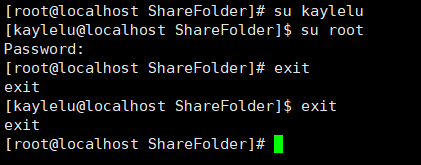

# 第12小节 文件系统目录结构

* 最上层为根目录"/"，在此目录下再创建了其他目录

* Linux的文件系统采用层级式的树状目录结构

* 在Linux世界中，一切皆文件

  

* 具体的目录结构

  * /bin[重点]（/usr/bin、/usr/local/bin)

    是Binary的缩写，这个目录存放着最经常使用的命令

  * /sbin(/usr/sbin、/usr/local/sbin)

    s就是super user的意思，这里存放的是系统管理员使用的系统管理程序

  * /home[重点]

    存放普通用户的主目录，在Linux中每个用户都有一个自己的目录，一般该目录名是以用户账号命名的

  * /root[重点]

    该目录为系统管理员，也称作超级权限者的用户主目录

  * /lib

    系统开机所需要的最基本的动态链接共享库，起作用类似于Windows里的DLL文件，几乎所有的应用程序都需要用到这些共享库

  * /lost+found

    这个目录一般情况下是空的，当系统非法关机后，这里就存放了一些文件

  * /etc[重点]

    所有的系统管理所需要的配置文件和子目录

  * /usr[重点]

    这是一个非常重要的目录，用户的很多应用程序和文件都在这个目录下，类似于windows下的program files目录

  * /boot[重点]

    存放的是启动Linux时使用的一些核心文件，包括一些链接文件和镜像文件

  * /proc

    这个目录一个虚拟的目录，它是系统内存的映射，访问这个目录来获取系统信息

  * /srv

    service缩写，该目录存放一些服务启动之后是需要提取的数据

  * /sys

    该目录安装了linux2.6内核中新出现的一个文件系统sysfs

  * /tmp

    这个目录是用来存放一些临时文件的

  * /dev

    类似于windows的设备管理器，把所有的硬件用文件的形式存储

  * /media[重点]

    linux系统会自动识别一些设备，例如U盘、光驱等等，当识别后，linux会把识别的设备挂载到这个目录下

  * /mnt[重点]

    系统提供该目录是为了让用户临时挂载别的文件系统的，我们可以将外部的存储挂载在/mnt/上，然后进入该目录就可以查看里面的内容了

  * /opt

    这是给主机额外安装软件所摆放的目录。如安装ORACLE数据库就可放到该目录下。默认为空。

  * /usr/local[重点]

    这是给另一个主机额外安装软件所安装的目录，一般是通过编译源码方式安装的程序

  * /var[重点]

    这个目录中存放着在不断扩充的东西，习惯将经常被修改的目录放在这个目录下。包括各种日志文件。


# 第15小节 Vi和Vim编辑器

* 基本介绍
  * 所有linux系统都会内建vi文本编辑器
  * Vim具有程序编辑的能力，可以看做是Vi编辑器的增强版本，可以主动的以字体颜色辨别语法的正确性，方便程序设计。代码补完、编译及错误跳转等方便编程的功能特别丰富，在程序员中被广泛使用。

* 三种模式

  * 正常模式

    以vim打开一个档案就直接进入正常模式了，在这个模式中，可以使用上下左右来移动光标，可以使用[删除字符]或者[删除整行]来处理档案内容，也可以使用[复制]、[粘贴]来处理你的文件数据

  * 插入(编辑)模式

    在正常模式下按下i、I、o、O、a、A、r、R等任何一个字母之后才会进入编辑模式，一般来说按i即可。

  * 命令行模式

    在正常模式下输入冒号:即可进入命令行模式，在这个模式中可以提供你相关指令，完成读取、存盘、替换、退出、显示行号等动作。

  * 详细使用方法可以参考[菜鸟教程Linux vi/vim](https://www.runoob.com/linux/linux-vim.html)


# 第16小节 关机重启注销

* 基本介绍

  shutdown -h now   立即关机

  shutdown -h 1 		1分钟以后关机

  reboot        	      	 重启机器

  sync						   把内存数据同步到磁盘（关机和重启之前允许一次肯定没错就对了）

* 用户登录与注销

  在运行级别3下，使用logout注销用户

  su 用户名                 切换用户

  切换用户后使用exit退出当前用户，返回上一个用户

  注意root切换到普通用户不需要密码，普通用户到root用户需要密码

  


# 第17-21小节 用户管理

* 基本介绍

  Linux系统是一个多用户多任务的操作系统，任何一个要使用系统资源的用户，都必须首先向系统管理员申请一个账号，然后以这个账号的身份进入系统

  Linux的用户至少用属于一个组

  用户家目录：默认情况下，/home目录下会有一个和用户同名的目录，为用户家目录，用户登录时会自动进入自己的家目录，这个符号表示家目录：~，esc按键下的波浪号。`cd  ~`即进入自己的家目录。特别的，root用户的家目录为/root

* 添加用户-useradd

  基本说明：通过useradd指令，可以增加一个用户

  useradd 用户名                      添加用户

  useradd -d 目录名 用户名     添加用户，并指定家目录位置

  useradd -g 组名                      添加用户，并且指定用户的组

* 添加/修改密码-passwd

  基本说明：通过passwd指令，可以给用户增加、修改密码。没有密码的用户是无法登陆的。

  passwd 用户名

* 删除用户-userdel

  userdel 用户名                    删除用户

  userdel -r 用户名				删除用户，并且删除用户家目录					

* 查询用户信息-id

  id 用户名

* 切换用户-su

  su 用户名

  返回上一个用户时，使用exit指令

* 查看当前用户

  whoami

* 用户组

  类似于角色，系统可以对有共性的多个用户进行统一的管理

* 增加组

  grouadd 组名

* 删除组

  groupdel 组名

* 修改用户的组

  usermod -g 用户组 用户名

* 用户和组的相关文件

  * /etc/passwd

    用户(user)的配置文件，记录用户的各种信息

    每行的含义：用户名:口令:用户标志号:组标志号:注释性描述:主目录:登陆Shell

  * /etc/shadow

    口令的配置文件

    每行的含义：登录名:加密口令:最后一次修改时间:最小时间间隔:最大时间间隔:警告时间:不活动时间:时效时间:标志

  * /etc/group

    组(group)的配置文件，记录Linux包含的组的信息

    每行的含义：组名:口令:组标志号:组内用户列表

# 第37小节 权限管理

* 修改权限-chmod
  基本说明：通过chmod指令，可以修改文件或者目录的权限
  使用方式：u表示user(所有者)\g表示group(所有组)\o表示other(其他)\a表示all(全部)
    1. 使用+、-、=方式来变更
        * chmod u=rwx,g=rx,o=x file
        * chmod o+w file
        * chmod a-x file
    2. 使用数字变更  r=4,w=2,x=1
        * chmod 751 file
        * chmod 753 file
        * chmod 642 file


* 修改文件所有者-chown
  基本说明：通过chown指令，可以修改文件或者目录的所有者
    1. 改变所有者
        * chown newowner file
    2. 改变所有者和所在组
        * chown newowner:newgroup file
    3. 递归改变子文件和目录
        * chown -R newowner file


* 修改文件所有组-chgrp
  基本说明：通过chgrp指令，可以修改文件或者目录的所有组
    1. 改变所有组
        * chgrp newgroup file
    2. 递归改变子文件和目录
        * chgrp -R newgroup file


# 第39小节 任务调度基本说明

* Linux可以定时的调度我们的脚本或者代码-crontab
    1. -e 编辑定时任务
    2. -l 查询定时任务
    3. -r 删除当前用户的所有定时任务
    
* 简单使用
    ```
    crontab -e
    执行上一条指令后会打开一个编辑器，输入如下指令
    */1 * * * * ll /etc/ >> /tmp/to.txt
    注意1后面的*中间的空格
    然后每隔一分钟/tmp/to.txt文件就会追加一个ll /etc/的内容了
    ```
    
* 5个占位符的说明
    |项目|含义|范围|
    |:---:|:---:|:---:|
    |第一个|一小时的第几分钟|0-59|
    |第二个|一天中的第几个小时|0-23|
    |第三个|一个月中的第几天|1-31|
    |第四个|一年当中的第几个月|1-12|
    |第五个|一周当中的星期几|0-7（0和7都表示星期日）|
    
* 占位符的特殊符号说明
    |特殊符号|含义|
    |:---:|:---:|
    |\*|代表任何时间。比如第一个的\*就代表每个小时的每分钟都执行|
    |,|代表不连续时间。比如0 2,6,8 \* \* \*就代表每天2点0分、6点0分、8点0分都执行一次|
    |-|代表连续时间。比如0 5 \* \* 1-6就代表周一至周六的5点0分执行一次|
    |\*/n|代表每隔多久执行一次。比如\*/1 * * * * *就代表每隔1分钟执行一次|

* 增强使用

  ```
  1.先在home目录下创建一个task.sh
  touch task.sh
  2.在task.sh内写入cal >> /tmp/mycal
  vim task.sh
  3.给task.sh添加执行权限
  chomd u+x task.sh
  4.执行crontab -e
  5.写入*/1 * * * * /home/task.sh
  6.每隔一分钟，/tmp/mycal里面就会加入当前的日历了
  可以使用tail -f /tmp/mycal查看更新
  ```


# 第58小节 Shell快速入门

* 第一行#!/bin/bash
* 命名规范：file.sh
* 执行方式
  * 相对路径：./file.sh
  * 绝对路径：/文件路径/file.sh
* 必须添加可执行权限才能执行
* 也可以用sh + 文件的方式执行

```
#!/bin/bash
echo "helloworld"
```


# 第59小节 Shell的变量

* Shell变量的介绍

  * 系统变量：$HOME、$PWD、$SHELL、$USER等

    $HOME:当前用户的home目录`echo $HOME`

    $PWD:当前文件所在的目录`echo $PWD`

    $SHELL:Shell的目录`echo $SHELL`

    $USER:当前用户名称`echo $USER`

  * 用户自定义变量：直接用名称就行

    普通变量直接使用就行，unset撤销

    ```
    A=100
    echo "A=$A"
    unset A
    echo "A=$A"
    ```

    静态变量不能unset，使用readonly修饰，不能撤销

    ```
    readonly A=99
    ehco "A=$A"
    unset A
    ehco "A=$A"
    ```

    变量可以提升为全局，供其他Shell程序使用（即第60节 环境变量）

    ```
    修改/etc/profile,增加如下语句
    MYNAME="LUTAO"
    exprot MYNAME
    修改后要生效可以source /etc/profile或者重启机器
    echo "MYNAE=$MYNAME"
    ```

  * set命令可以显示shell的所有变量

* 变量命名规则
  * 字母、数字、下划线，不能以数字开头
  * 等号两边不能有空格
  * 变量名称一般用大写

* 将命令的返回值赋值给变量
  * A=\`ls /home\` 用两个\`包裹就好，\`这个符号是英文输入法下的esc下面的键，反引号
  * A=$(ls /home)

* 注释

  ```
  #单行注释
  : '
  冒号 空格 单引号开始
  多
  行
  注
  释
  开始和结束必须独占一行
  单引号结束
  '
  ```
  


# 第61小节 位置参数变量

* $n

  * n为数字，$0表示命令本身，$1-$9表示第一到第九个参数，第10个以上的要用${n}，比如${10}

* $*

  * 这个变量代表命令行中的所有参数，把所有参数看成一个整体

* $@

  * 这个变量代表命令行中的所有参数，但是把参数区别对待

* $#

  * 这个变量代表命令行中的参数个数

  ```
  #!/bin/bash
  ehco "$0 $1 $2"
  ehco "$*"
  ehco "$@"
  ehco "$#"
  ```

  

# 第62小节 预定义变量

即Shell设计者事先定义好了的变量

* \$\$
  * 当前进程的进程号
* $!
  * 后台运行的最后一个进程的进程号
* $?
  * 最后一次执行的命令的返回状态，0为成功，其他为失败。失败代码可自定义


# 第63小节 预算符

* $((运算式)) 或者 $[运算式]

* expr m + n 

  * 注意运算符间要用空格
  *  +，-，\\*，/，%
  * 注意乘号前面的反斜杠

  ```
  #!/bin/bash
  RESULT1=$[(1+2)*3]
  echo "$RESULT1"
  RESULT2=$(((1+2)*3))
  echo "$RESULT2"
  TEMP=`expr 1 + 2`
  RESULT3=`expr $TEMP \* 3`
  echo "$RESULT3"
  RESULT4=$[$1*$2]
  echo "$RESULT4"
  ```

  

# 第64小节 条件判断

* 基本语法

  [ 条件 ]  一定主要条件前后的空格

  非空返回true，可以用%?验证，0位true，其他为false

* 常用判断语句
  * 整数比较
    * = 字符串比较
    * -lt 小于
    * -le 小于等于
    * -eq 等于
    * -gt 大于
    * -ge 大于等于
    * -ne 不等于
  * 文件权限判断
    * -r 可读
    * -w 可写
    * -x 可执行
  * 文件类型判断
    * -f 文件存在且是常规文件
    * -e 文件存在
    * -d 文件存在且是一个目录

* 应用实例

  * [ atguigu ]					返回true
  * \[\]                                   返回false
  * [ 条件 ] && ehco OK || echo NotOk   条件满足则执行第一条语句

  ```
  #!/bin/bash
  if [ "OK" = "OK" ]
  then
      echo "equal"
  fi
  
  if [ 23 -ge 22 ]
  then 
      echo "大于等于"
  fi
  
  if [ -e /opt/helloworld.sh ]
  then
      echo "文件存在"
  fi
  ```


# 第65小节 流程控制if

* 基本语法1

  ```
  if [ 条件 ];then
  	程序
  fi
  ```

* 基本语法2

  ```
  if [ 条件 ]
  then
  	程序
  elif [ 条件 ]
  then 
  	程序
  fi
  ```

```
#!/bin/bash
if [ 34 -gt 33 ];then
    echo "34大于33"
fi

if [ 34 -gt 33 ]
then
    echo "34大于33"
fi
```


# 第66小节 流程控制case

* 基本语法

  ```
  case 变量 in
  "值1")
  	程序1
  ;;
  "值2")
  	程序2
  ;;
  *)
  	程序3
  ;;
  esac
  ```

```
#!/bin/bash
case $1 in
"1")
	echo "周一"
;;
"2")
	ehco "周二"
;;
*)
	echo "其他"
;;
esac
```


# 第67小节 流程控制for

* 基本语法1

  ```
  for 变量 in 值1 值2 值3
  do
  	程序
  done
  ```

* 基本语法2

  ```
  for((初始值;控制条件;变量变化))
  do
  	程序
  done
  ```

```
#!/bin/bash
for i in "$*"
do
	echo "变量i=$i"
done

for j in "$@"
do
	echo "变量j=$j"
done

read -p "请输入累加值" N
SUM=0
for((k=0;k<=N;k++))
do
	SUM=$[$SUM+$k]
done
echo "累加结果为$SUM"
```


# 第68小节 流程控制while

* 基本语法

  ```
  while [ 控制条件 ]
  do
  	程序
  done
  ```

```
#!/bin/bash
SUM=0
i=0
read -p "请输入累加值" N
while [ $i -le $N ]
do
	SUM=$[$SUM+$i]
	i=$[$i+1]
done
echo "累加结果为$SUM"
```


# 第69小节 从控制台读取

* read [选项] (参数)
* 选项
  * -p 指定读取时的提示符
  * -t 指定读取等待时间

```
#!/bin/bash
read -p "请输入一个数" NUM
echo "您输入的为$NUM"
read -t 5 -p "请输入另一个数" NUM2
echo "您输入的为$NUM2"
```


# 第70小节 系统函数

* basename

  返回完整字符串(路径)最后一个/以后的部分，如果带了后缀则不显示后缀部分字符串

  ```
  #!/bin/bash
  basename /opt/helloworld.sh
  basename /opt/helloworld.sh sh
  basename /opt/helloworld.sh .sh
  ```

* dirname

  返回完整字符串(路径)最后一个/以前的部分

  ```
  #!/bin/bash
  dirname /opt/helloworld.sh
  ```

  

# 第71小节 自定义函数

* 基本语法

  ```
  function 函数名 ()
  {
  	程序
  	return 返回值;   #返回值可以省略
  }
  函数的返回值通过$?的方式读取
  ```

```
#!/bin/bash
fuction GetSum()
{
	SUM=$[$1+$2]
	return $SUM;
}

SUM=$(GetSum(1 2))
echo "$SUM"function GetSum()
{
	SUM1=$[$1+$2]
    echo "$SUM1"
	return $SUM1;
}
GetSum 1 2
SUM=$?
echo "$SUM"
```

